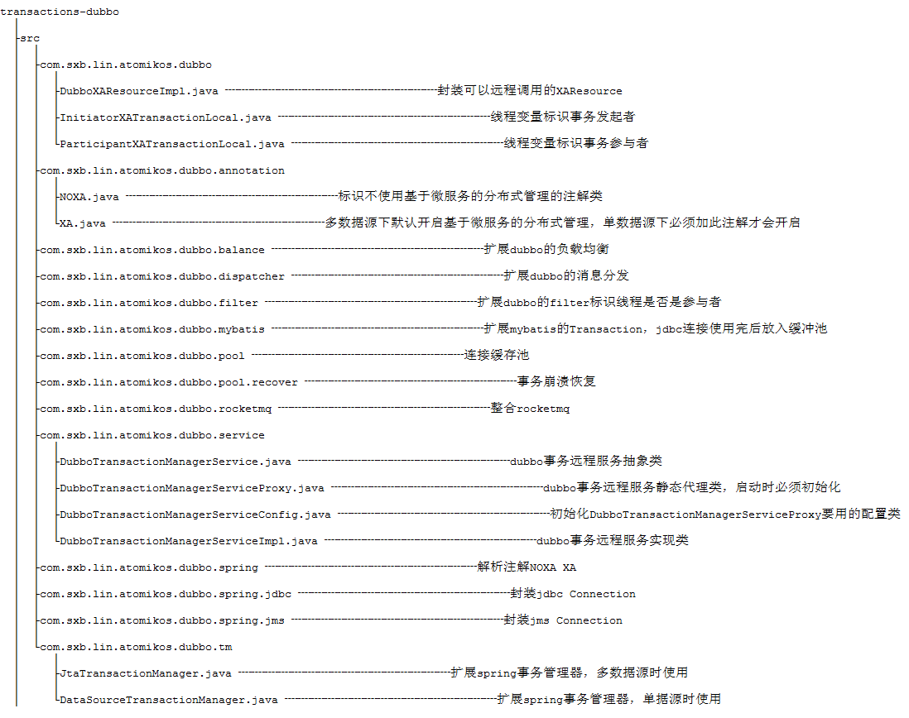
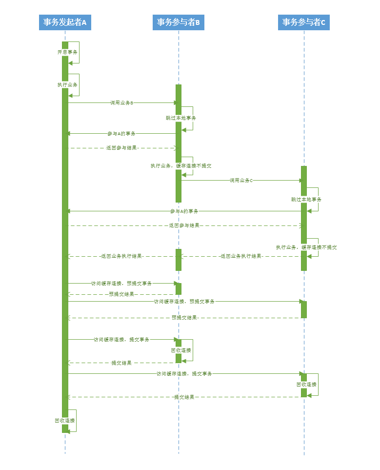

# transactions-dubbo
dubbo项目基于atomikos的分布式事务管理

## 框架介绍

​	transactions-dubbo其实是对开源的分布式事务管理框架atomikos应用范围的一个扩展。atomikos本身支持使用两段提交协议在一个项目中，管理多个数据库事务，如mysql的事务，和符合JMS规范的多个消息事务，如activemq的事务。但是现在因为微服务框架的流行使得多个数据库的事务不在一个项目内，使得一个使用微服务的业务操作可能无法达到一致性。atomikos本身不支持多个微服务项目间的事务管理，transactions-dubbo正好弥补了atomikos的这一不足，为微服务环境下事务的强一致性和最终一致性提供解决方案。

​	项目现在有很多不足，微服务框架只支持dubbo，数据库持久化框架只支持mybatis，只支持管理数据库事务、activemq的事务、rocketmq的事务，希望以后有需求可以支持更多的框架。

## 框架特点

​	1.与原生的spring事务管理机制完美整合，无需写多余代码

​	2.支持本地事务和分布式事务共存

​	3.事务管理器去中心化，每个微服务节点都有事务管理器本身就是形成一个集群，无需再做集群配置，一个事务管理器崩溃不会影响其它运行

​	4.使用数据库本身为两段提交提供的recover机制恢复数据，在事务异常中断的情况下无需考虑事务补偿

​	5.支持使用数据库的强一致性事务，和使用消息队列activemq、rocketmq的最终一致性事务

## 原理介绍

#### 	1.了解分布式事务的概念

​	https://my.oschina.net/pingpangkuangmo/blog/417479

#### 	2.依赖其它框架

​	（1）开源的atomikos框架具有管理分布式事务的功能，atomikos采用两段提交协议，具有恢复崩溃事务的能力。在本项目中atomikos主要作用是协调多个dubbo项目的事务，统一提交或回滚。当某些项目崩溃导致数据不一致时，采用recover回查机制恢复或者回滚掉未完成的事务。具体可查看https://www.atomikos.com/Documentation/TransactionsEssentialsArchitecture

​	（2）spring-tx是spring框架管理事务的核心组件，利用spring提供的声明式事务配置和基于@Transactional的注解事务配置可以很轻松的给业务加上事务，少写很多额外代码。通过扩展PlatformTransactionManager可以实现事务发起者与事务参与者的业务分离，发起者需要开启事务和管理参与者的事务，而参与者只需要参与到发起者的事务当中去，不需要开启事务。

​	（3）dubbo是非常流行的RPC框架，dubbo主要提供通信功能。事务管理器与事务参与者的数据交互，就是通过dubbo暴露和消费服务DubboTransactionManagerService来完成的。通过扩展dubbo的Filter可以实现事务发起者和事务参与者的传递，比如服务消费者是事务发起者，那么服务提供者就应该被标识为事务参与者。服务消费者是事务参与者，那么服务提供者也应该被标识为事务参与者。发起者与参与者的标识是通过线程变量ThreadLocal来标识的。通过扩展LoadBalance实现集群模式下选择固定消费者，比如两段提交协议的预提交和提交都应该在同一个项目的同一个连接上执行，那么两次请求都应该发送到同一台服务器上。

​	（4）mybatis是数据库持久化框架，所有的sql都会通过mybatis使用数据库的连接来执行。mybatis主要提供的功能是，在使用数据库连接执行完sql后不马上进行回收，而是把连接放到缓存池中，等到事务发起者的事务管理器发送提交或回滚的命令后再回收。

​	（5）activemq是符合JMS规范的消息队列，本身提供对两段提交协议的支持。atomikos支持整合符合JMS规范的消息队列，使用activemq的事务消息，可以实现基于消息的最终一致性事务。

​	（6）rocketmq是阿里开源的一款高性能、高吞吐量的分布式消息中间件，但是rocketmq本身不支持JMS规范，但是rocketmq的消息事务支持两段提交，并且可以主动回查事务状态，所以在本项目中提供了对rocketmq的整合使用。使用rocketmq的事务消息，可以实现基于消息的最终一致性事务。

#### 	3.项目结构

​	

#### 	4.调用时序图

​	

#### 	5.recover

​	atomikos的recover机制是每隔一段时间用xa recover命令访问本地数据库资源查询未完成的事务，把这些事务与本地日志未完成的事务做对比，如果本地事务有相关的日志就执行提交或者回滚，恢复之前未完成的事务。transactions-dubbo的recover机制也是使用atomikos的recover机制，但是每一个执行过的远程资源都会有一个过期时间（过期时间就是事务过期的时间加了3秒），超过过期时间的远程资源会被清除，这样就不会每一个资源一直执行xa recover。

## 使用说明

#### 1.连接池配置

多数据源项目

```java
    @Primary
    @Bean(initMethod = "init",destroyMethod = "close")
    public DataSource dataSource1() throws SQLException{
		
	DruidXADataSource druidXADataSource = new DruidXADataSource();
        druidXADataSource.setUrl("jdbc:mysql://ip:3306/demo1-a");
        druidXADataSource.setUsername("用户名");
        druidXADataSource.setPassword("密码");
        
        AtomikosDataSourceBean atomikosDataSourceBean = new AtomikosDataSourceBean();
        atomikosDataSourceBean.setUniqueResourceName("数据库唯一资源名");
        atomikosDataSourceBean.setXaDataSource(druidXADataSource);
        
        return atomikosDataSourceBean;
    }

    @Bean(initMethod = "init",destroyMethod = "close")
    public DataSource dataSource2() throws SQLException{
		
	DruidXADataSource druidXADataSource = new DruidXADataSource();
        druidXADataSource.setUrl("jdbc:mysql://ip:3306/demo1-b");
        druidXADataSource.setUsername("用户名");
        druidXADataSource.setPassword("密码");
        
        AtomikosDataSourceBean atomikosDataSourceBean = new AtomikosDataSourceBean();
        atomikosDataSourceBean.setUniqueResourceName("数据库唯一资源名");
        atomikosDataSourceBean.setXaDataSource(druidXADataSource);
        
        return atomikosDataSourceBean;
    }
```

单数据源项目

```java
    @Bean(initMethod = "init",destroyMethod = "close")
    public DataSource dataSource() throws SQLException{
		
	DruidXADataSource druidXADataSource = new DruidXADataSource();
        druidXADataSource.setUrl("jdbc:mysql://192.168.0.252:3306/demo3-a");
        druidXADataSource.setUsername("用户名");
        druidXADataSource.setPassword("密码");
        
        return druidXADataSource;
    }
```

#### 2.事务管理器配置

多数据源项目

事物的使用：只需要在事物发起者和事物参与者的方法上加@Transactional注解

```sql
    @Bean(initMethod="init",destroyMethod="close")
    public UserTransactionManager userTransactionManager(){
        UserTransactionManager userTransactionManager = new UserTransactionManager();
        return userTransactionManager;
    }
    
    @Bean
    public UserTransactionImp userTransactionImp() throws SystemException{
        UserTransactionImp userTransaction = new UserTransactionImp();
        return userTransaction;
    }
    
    //使用com.sxb.lin.atomikos.dubbo.tm.JtaTransactionManager
    @Bean
    @Autowired
    public JtaTransactionManager jtaTransactionManager(
    		UserTransactionManager userTransactionManager,UserTransactionImp userTransaction){
        JtaTransactionManager jtaTransactionManager = new JtaTransactionManager();
        jtaTransactionManager.setUserTransaction(userTransaction);
        jtaTransactionManager.setTransactionManager(userTransactionManager);
        return jtaTransactionManager;
    }
```

单数据源项目

事物的使用：只需要在事物发起者的方法上加@Transactional、@XA注解，事物参与者的方法上加@Transactional注解

<font color=red>注意：单数据源项目的事物发起者比多数据源的事物发起者多了一个@XA注解，原因是单数据源默认使用的是1段提交，
加@XA注解的目的是让单数据源的项目使用2段提交，事物参与者单数据源项目和多数据源项目一样加一个@Transactional注解就够了</font>

```java
    @Bean(initMethod="init",destroyMethod="close")
    public UserTransactionManager userTransactionManager(){
        UserTransactionManager userTransactionManager = new UserTransactionManager();
        return userTransactionManager;
    }
    
    @Bean
    public UserTransactionImp userTransactionImp() throws SystemException{
        UserTransactionImp userTransaction = new UserTransactionImp();
        return userTransaction;
    }

    //使用com.sxb.lin.atomikos.dubbo.tm.DataSourceTransactionManager
    @Bean
    @Autowired
    public DataSourceTransactionManager dataSourceTransactionManager(
    		UserTransactionManager userTransactionManager,
    		UserTransactionImp userTransaction,DataSource dataSource){
		
    	DataSourceTransactionManager dataSourceTransactionManager = new DataSourceTransactionManager();
    	dataSourceTransactionManager.setDataSource(dataSource);
    	dataSourceTransactionManager.setUserTransaction(userTransaction);
    	dataSourceTransactionManager.setTransactionManager(userTransactionManager);
    	return dataSourceTransactionManager;
    }
```

如果使用声明式，可以使用以下配置

```java
    @Bean
    @Autowired
    public DefaultPointcutAdvisor defaultPointcutAdvisor(PlatformTransactionManager transactionManager){
        AspectJExpressionPointcut pointcut = new AspectJExpressionPointcut();
        pointcut.setExpression("execution(* service.impl..*(..))");
        
        Properties attributes = new Properties();
        attributes.setProperty("add*", "PROPAGATION_REQUIRED,-Exception");
        attributes.setProperty("save*", "PROPAGATION_REQUIRED,-Exception");
        attributes.setProperty("update*", "PROPAGATION_REQUIRED,-Exception");
        attributes.setProperty("edit*", "PROPAGATION_REQUIRED,-Exception");
        attributes.setProperty("delete*", "PROPAGATION_REQUIRED,-Exception");
        attributes.setProperty("remove*", "PROPAGATION_REQUIRED,-Exception");
        
        attributes.setProperty("get*", "PROPAGATION_REQUIRED,readOnly");
        attributes.setProperty("find*", "PROPAGATION_REQUIRED,readOnly");
        attributes.setProperty("load*", "PROPAGATION_REQUIRED,readOnly");
        attributes.setProperty("search*", "PROPAGATION_REQUIRED,readOnly");
        attributes.setProperty("select*", "PROPAGATION_REQUIRED,readOnly");
        attributes.setProperty("check*", "PROPAGATION_REQUIRED,readOnly");
        TransactionInterceptor advice = new TransactionInterceptor(transactionManager, attributes);
        
	//加此TransactionAttributeSource代理的目的，确保可以扫描到注解@XA @NOXA
        TransactionAttributeSource transactionAttributeSource = advice.getTransactionAttributeSource();
        TransactionAttributeSourceProxy transactionAttributeSourceProxy = new TransactionAttributeSourceProxy();
        transactionAttributeSourceProxy.setTransactionAttributeSource(transactionAttributeSource);
        advice.setTransactionAttributeSource(transactionAttributeSourceProxy);
        
        DefaultPointcutAdvisor advisor = new DefaultPointcutAdvisor();
        advisor.setPointcut(pointcut);
        advisor.setAdvice(advice);
        advisor.setOrder(Ordered.LOWEST_PRECEDENCE);
        
        return advisor;
    }
```

#### 3.SqlSessionFactory配置

```java
    //多数据源项目需要配置多个，单数据源项目配置一个
    @Bean
    @Autowired
    public SqlSessionFactoryBean sqlSessionFactory(DataSource dataSource) throws IOException{
        SqlSessionFactoryBean bean = new SqlSessionFactoryBean();
        PathMatchingResourcePatternResolver resolver = new PathMatchingResourcePatternResolver();  
        bean.setDataSource(dataSource);
        bean.setMapperLocations(resolver.getResources("classpath:com/sxb/lin/transactions/dubbo/test/demo3/a/mapping/*.xml"));
        bean.setTransactionFactory(new XASpringManagedTransactionFactory("数据库唯一资源名"));
        return bean;
    }
```

#### 4.transactions-dubbo配置

```sql
    //在配置transactions-dubbo之前，请确保已经配置好相关的dubbo配置
    @Bean
    @Autowired
    public DubboTransactionManagerServiceProxy dubboTransactionManagerServiceProxy(
	ApplicationConfig applicationConfig, RegistryConfig registryConfig, 
	ProtocolConfig protocolConfig, ProviderConfig providerConfig, 
      	ConsumerConfig consumerConfig,
	@Qualifier("dataSource1") DataSource ds1, 
      	@Qualifier("dataSource2") DataSource ds2,
	TransactionInterceptor transactionInterceptor){
		
	//加此TransactionAttributeSource代理的目的，确保可以扫描到注解@XA @NOXA
	TransactionAttributeSource transactionAttributeSource = transactionInterceptor.getTransactionAttributeSource();
    	TransactionAttributeSourceProxy transactionAttributeSourceProxy = new TransactionAttributeSourceProxy();

    	transactionAttributeSourceProxy.setTransactionAttributeSource(transactionAttributeSource);
    	transactionInterceptor.setTransactionAttributeSource(transactionAttributeSourceProxy);
		
	Map<String,UniqueResource> dataSourceMapping = new HashMap<String, UniqueResource>();
	dataSourceMapping.put("数据库唯一资源名A", new DataSourceResource("数据库唯一资源名A", ds1));
	dataSourceMapping.put("数据库唯一资源名B", new DataSourceResource("数据库唯一资源名B", ds2));
		
	Set<String> excludeResourceNames = new HashSet<>();
	excludeResourceNames.add("数据库唯一资源名A");
	excludeResourceNames.add("数据库唯一资源名B");
		
	DubboTransactionManagerServiceConfig config = new DubboTransactionManagerServiceConfig();
	config.setApplicationConfig(applicationConfig);
	config.setRegistryConfig(registryConfig);
	config.setProtocolConfig(protocolConfig);
	config.setProviderConfig(providerConfig);
	config.setConsumerConfig(consumerConfig);
	config.setUniqueResourceMapping(dataSourceMapping);
	config.setExcludeResourceNames(excludeResourceNames);
		
	DubboTransactionManagerServiceProxy instance = DubboTransactionManagerServiceProxy.getInstance();
	instance.init(config);
		
	return instance;
    }
```

#### 5.更多配置

​	更多配置请参观demo

## demo演示

​	https://github.com/L457765899/transactions-test

